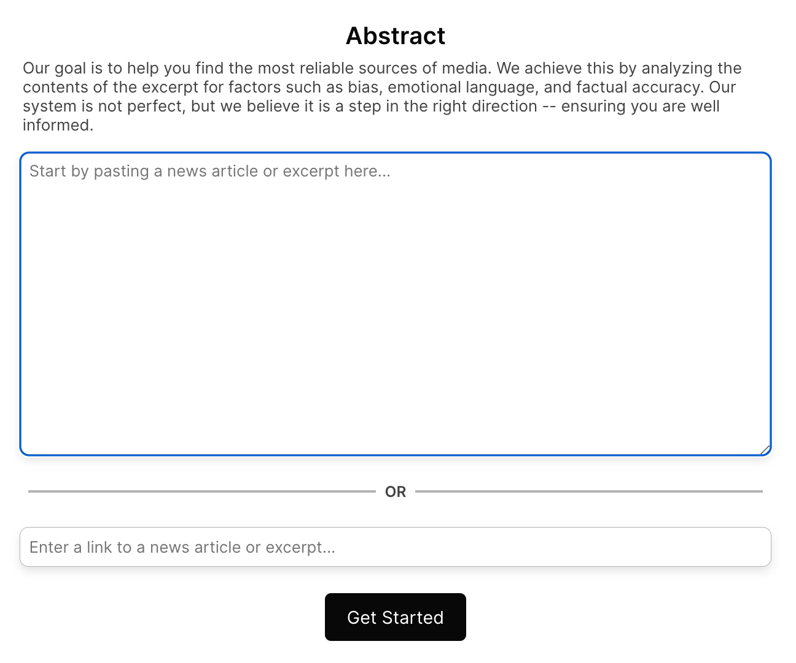
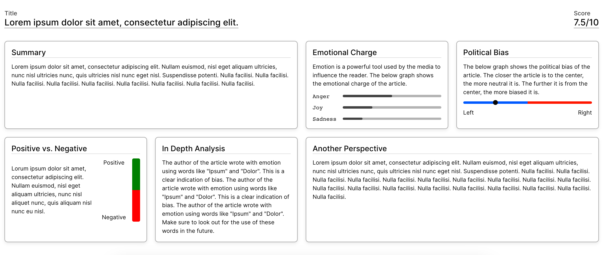

    

<h1> Vision </h1>

Our goal is to enable consumers to access reliable information about news, media, journalism, or anything that may have inherent bias, which could hinder an objective approach to sharing information.
 
 

<h1> Usage </h1>

 Input relevant news article or text 

 Results 

<h1> Citations and Developement Resources </h1>

[OpenAI GPT-4](https://openai.com/) - enables the analysis of articles for summarization and political affiliation, enhancing comprehension and insight into their conten through prompt engineering.  
 
[Hume Text Streaming](https://dev.hume.ai/docs/streaming-api-tutorial) - performs sentimental analysis with string embedded transformations to offer more precise and valuable insights into emotional context of text.  
 
[React](https://react.dev/) - used for the front-end  due to its inherent ability to promote component reusability, making it an ideal choice for creating dynamic and scalable user interfaces.   
  
[Python FastAPI](https://fastapi.tiangolo.com/lo/) - used for the back-end because of its developer friendly design, and efficiency 